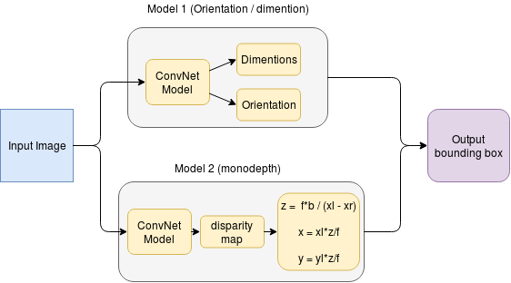
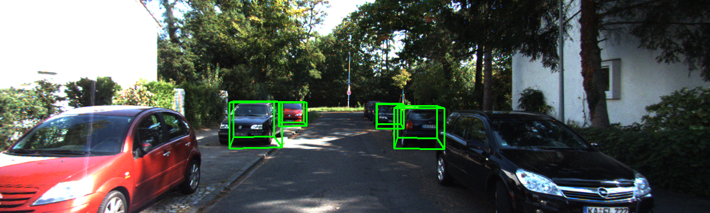
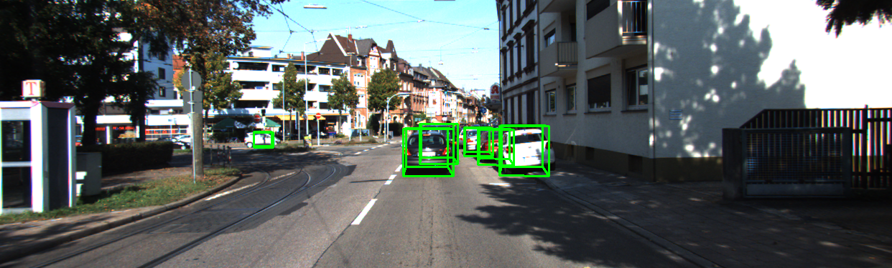

# Monocular Vehicle Localization (In Progress)

## Introduction

  Estimating the orientation and the size of vehicle using a single 2d image. The output is a 3d bounding box around the detected vehicle. 

The model is trained on KITTI dataset for 3d object detection. The prediction is made little efficient by detecting the 2d bounding frames with a separate NN model and running the Pose estimation on the particular frame.

The 2d detection is done with a simple SSD Tensorflow object detection pretrained model for now; can be optimized with a standalone vehicle detection model. The 3d prediction model is constructed of CNN layers and outputs the dimension and the orientation of the detected object. The traditional approach utilizes a model that regresses the 3d coordinates of the object detected. Here, [monodepth](https://github.com/mrharicot/monodepth) model is used to determine the depth of the object detected and the corresponding x,y position in the camera coordinates is calculated by stereo vision triangulation. This helps in the precise perception of the environment.

## Architecture
   
   


## Prerequisites
  + Python 2
  + Tensorflow
  + [Tensorflow models](https://github.com/tensorflow/models)
  + Keras
  + Numpy
  + OpenCV2
  + Matplotlib
  + [KITTI dataset](http://www.cvlibs.net/datasets/kitti/eval_object.php?obj_benchmark=3d)
 
## Usage

Edit the necessary configurations and paths in `config.py`

```
#export tensorflow utils for 2d detection model
cd tensorflow/models/research
export PYTHONPATH=$PYTHONPATH:`pwd`:`pwd`/slim

#export current working directory
cd working_directory
export PYTHONPATH=$PYTHONPATH:`pwd`

#train the model
python main.py --mode=train

#evaluate example images
python predict.py
python evaluation.py
```

## Dataset 

For training, [KITTI 3d detection dataset](http://www.cvlibs.net/datasets/kitti/eval_object.php?obj_benchmark=3d) was used. Note that the location of the object is in camera coordinates, which is defined to be `camera- x:right y:down z:forward` Below mentioned table from KITTI object development kit describes the data in the labeles file.

```
#Values    Name      Description
----------------------------------------------------------------------------
   1    type         Describes the type of object: 'Car', 'Van', 'Truck',
                     'Pedestrian', 'Person_sitting', 'Cyclist', 'Tram',
                     'Misc' or 'DontCare'
   1    truncated    Float from 0 (non-truncated) to 1 (truncated), where
                     truncated refers to the object leaving image boundaries
   1    occluded     Integer (0,1,2,3) indicating occlusion state:
                     0 = fully visible, 1 = partly occluded
                     2 = largely occluded, 3 = unknown
   1    alpha        Observation angle of object, ranging [-pi..pi]
   4    bbox         2D bounding box of object in the image (0-based index):
                     contains left, top, right, bottom pixel coordinates
   3    dimensions   3D object dimensions: height, width, length (in meters)
   3    location     3D object location x,y,z in camera coordinates (in meters)
   1    rotation_y   Rotation ry around Y-axis in camera coordinates [-pi..pi]
   1    score        Only for results: Float, indicating confidence in
                     detection, needed for p/r curves, higher is better.
```

For the final prediction, the bbox data is provided by the 2d object detection model `ssd_detection.py` which uses pretrained Tensorflow COCOmobilenet to output a 2d bounding box.

## Ouput

The below images are the ouput from the partially trained model on 8 vCPUs, 52 GB memory machine (no GPU). The output will be more precise after complete training (currently trained only for 1 out of 500 Epochs).

   

   

## References

+ [Vision meets Robotics: The KITTI Dataset](http://www.cvlibs.net/publications/Geiger2013IJRR.pdf)
+ "3D Bounding Box Estimation Using Deep Learning and Geometry" [link to paper](https://arxiv.org/abs/1612.00496)
+ [Tensorflow object detection](https://github.com/tensorflow/models)
+ [smallcorgi/3D-Deepbox](https://github.com/smallcorgi/3D-Deepbox)
+ [mrharicot/monodepth](https://github.com/mrharicot/monodepth)
